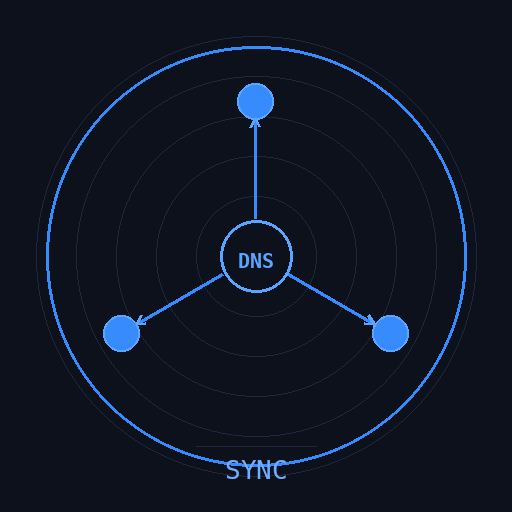

# unifi-dns-sync

<p align="center">
  
</p>

<p align="center">
  <a href="https://github.com/nofuturekid/unifi-dns-sync/actions/workflows/build.yml">
    
  </a>
  <a href="https://ghcr.io/nofuturekid/unifi-dns-sync">
    
  </a>
  
</p>

Automatically creates and deletes **UniFi local DNS CNAME records** when Docker containers start or stop on unRAID.

No more manually adding DNS entries every time you spin up a new container. Give your container a name, start it — it's in DNS.

---

## How it works

```
Container starts (macvlan IP)
        │
        ▼
unifi-dns-sync detects the Docker event
        │
        ▼
UniFi API  →  plex.kroll-home.de  CNAME  →  npm.kroll-home.de
```

When a container **stops**, the CNAME is automatically **deleted**.  
Containers without a dedicated IP (bridge/host network) are silently ignored.  
On startup, all already-running containers are synced automatically.

---

## Prerequisites

1. **UniFi Gateway** with Network API support (UnifiOS 4.x+, Network 9.x+)
2. **UniFi API Key** — create one in:  
   `UniFi → Settings → Control Plane → Integrations`
3. **NPM A-Record** — create once manually in UniFi local DNS:  
   `npm.yourdomain.com  →  A  →  <IP of your NPM container>`
4. **Docker containers** with dedicated macvlan IPs (standard unRAID setup)

---

## Installation

### unRAID (recommended)

Copy the template directly to your unRAID server and use it from the Docker tab:

```bash
wget -O /boot/config/plugins/dockerMan/templates-user/unifi-dns-sync.xml \
  https://raw.githubusercontent.com/nofuturekid/unifi-dns-sync/main/unifi-dns-sync.xml
```

Then go to **Docker → Add Container** and select the `unifi-dns-sync` template.

### Docker Compose

```yaml
services:
  unifi-dns-sync:
    image: ghcr.io/nofuturekid/unifi-dns-sync:latest
    container_name: unifi-dns-sync
    restart: unless-stopped
    volumes:
      - /var/run/docker.sock:/var/run/docker.sock:ro
    environment:
      UNIFI_HOST: "https://192.168.11.1"
      UNIFI_API_KEY: "your-api-key-here"
      DOMAIN: "kroll-home.de"
      NPM_CNAME_TARGET: "npm.kroll-home.de"
```

---

## Configuration

| Variable | Default | Required | Description |
|---|---|---|---|
| `UNIFI_HOST` | `https://192.168.1.1` | ✅ | URL of your UniFi Gateway |
| `UNIFI_API_KEY` | — | ✅ | UniFi API Key |
| `UNIFI_SITE` | `default` | | UniFi site name |
| `DOMAIN` | — | ✅ | Internal domain (e.g. `kroll-home.de`) |
| `NPM_CNAME_TARGET` | — | ✅ | CNAME target (e.g. `npm.kroll-home.de`) |
| `SKIP_NETWORKS` | `bridge,host,none` | | Docker networks to ignore |
| `SKIP_CONTAINERS` | — | | Container names to never touch |
| `LOG_LEVEL` | `INFO` | | `DEBUG`, `INFO`, `WARNING`, `ERROR` |

---

## Container naming

Container names are automatically lowercased before being used as subdomains:

| Container name | DNS entry |
|---|---|
| `plex` | `plex.kroll-home.de` |
| `Sabnzbd` | `sabnzbd.kroll-home.de` |
| `MQTT` | `mqtt.kroll-home.de` |

---

## Troubleshooting

```bash
# View live logs
docker logs -f unifi-dns-sync

# Test UniFi API connectivity
curl -k -X GET 'https://192.168.11.1/proxy/network/v2/api/site/default/static-dns' \
  -H 'X-API-KEY: your-api-key' \
  -H 'Accept: application/json'
```

---

## License

MIT — see [LICENSE](LICENSE)
